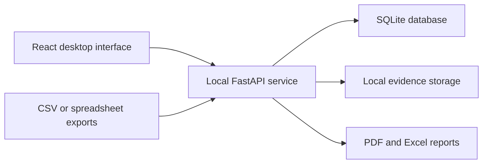

# Backstop — Offline Chargeback Management

Backstop is a desktop application that helps a small trading company organize and manage chargeback cases without sending customer or payment information to an external server.

> **Project type:** Part-time contract work  
> **My role:** Full-stack software developer  
> **Technologies:** React, FastAPI, SQLite, Python, TypeScript, SQLAlchemy, Pydantic, AES-256-GCM

## Project Overview

The company previously handled chargeback cases through a manual workflow. Backstop brings dispute records, deadlines, evidence, risk indicators, and reports into one local application that staff can use from a company-owned computer.

The application was designed to meet three practical requirements:

- Keep sensitive customer and payment information on the company's device.
- Avoid the cost and maintenance of a hosted server for a small number of users.
- Make chargeback cases easier to track, review, and document.

## My Contribution

I translated the company's existing chargeback workflow into a full-stack application and worked across the interface, API, data model, security controls, imports, and reporting.

My work included:

- Building the user interface in React and TypeScript.
- Developing local API services with FastAPI, Pydantic, and SQLAlchemy.
- Modeling chargeback cases, deadlines, statuses, evidence, and risk indicators in SQLite.
- Supporting CSV and spreadsheet imports from payment-platform exports.
- Creating PDF and Excel reporting workflows.
- Packaging the application so the API and interface can run together as a desktop program.
- Protecting selected sensitive fields with authenticated encryption and searchable indexes.

## How It Works

The program runs locally rather than depending on a public web server. Application records are stored in a single SQLite database, while supporting evidence and generated reports remain in local folders controlled by the company.

## Selected Features

- Import chargeback records from CSV or spreadsheet exports, with support for manual entry.
- Review loss totals, chargeback ratios, deadlines, win rates, and higher-risk cases from a dashboard.
- Track each dispute through its workflow and maintain an evidence checklist.
- Flag cases with urgent deadlines, repeat customers, limited verification, missing documentation, or costs that may exceed the disputed value.
- Generate PDF and Excel reports for internal review.
- Back up the application database and evidence folder using the company's existing file-sync process.

## Engineering Decisions

### Local-first architecture

SQLite was selected because the application serves a small number of users on one company-owned device. It provides reliable structured storage without requiring a separately maintained database server.

### Protection of sensitive information

Selected customer fields are encrypted with AES-256-GCM. Searchable keyed indexes allow the application to find or group protected records without storing the corresponding values as readable plaintext.

### Replaceable storage components

The application separates storage behavior from the business workflow. The current version uses local files and SQLite, while the interfaces leave room for a different database or evidence-storage service if the company's needs grow.

### Desktop delivery

The production build starts the local API and opens the React interface in a desktop window. The service binds locally, allowing staff to use the application without operating a public server.

## Validation and Outcome

- Converted a manual chargeback process into an application used by company staff in their regular workflow.
- Kept customer and payment information on company-controlled equipment.
- Removed the need for monthly application-hosting expenses.
- Tested imports, dashboard calculations, risk rules, local storage, and report generation using representative sample records before use.

## What I Learned

This project required balancing software design with the needs of a small business. A hosted cloud architecture would have added recurring cost and operational complexity without improving the initial workflow. Building a local-first application taught me to choose technology based on the users, data sensitivity, expected scale, and maintenance constraints rather than defaulting to the most complex architecture.

I also gained experience turning an informal business process into structured data, API operations, interface states, validation rules, and reports that non-technical users could work with.

## Development Process

AI-assisted tools were used selectively for prototyping and debugging. I remained responsible for translating requirements, making architecture decisions, integrating the components, reviewing generated suggestions, and validating the completed workflows.

## Repository Notice

This repository is a project overview only. The production source code and company data are private because the application was developed through contract work and handles sensitive business information. The descriptions here are limited to non-confidential architecture, responsibilities, and outcomes.

